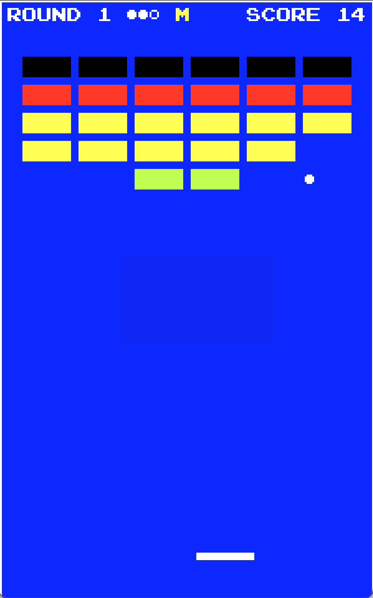

# Breakout

`Breakout` is an adaption of the [classic](https://en.wikipedia.org/wiki/Breakout_(video_game)) arcade video game.

`Breakout` is written using [`GL GFX`](../README.md). Every 25 points gained increases the speed of the ball by 10%. At each new level the paddle size decreases a quarter in size, as far down as the ball size.



## Usage

`Breakout` is compiled with:

```shell
cmake .
make
```

This results in a binary executable called `Breakout`, which is invoked as:

```shell
./Breakout
```

`Breakout` can use both mouse (default) or keyboard input. The table below lists the keys that are recognized and their associated action.

|key    |action            |
|-------|------------------|
|`space`|start game        |
|`m`    |toggle mouse mode |
|`,`    |move left         |
|`.`    |move right        |
|`r`    |restart           |
|`p`    |(un)pause         |
|`f`    |display frame rate|
|`q`    |quit              |

## Notes

1. Sound assets are located in the `gfx`-directory.

## BSD-3 License

Redistribution and use in source and binary forms, with or without modification, are permitted provided that the following conditions are met:

1. Redistributions of source code must retain the above copyright notice, this list of conditions and the following disclaimer.

2. Redistributions in binary form must reproduce the above copyright notice, this list of conditions and the following disclaimer in the documentation and/or other materials provided with the distribution.

3. Neither the name of the copyright holder nor the names of its contributors may be used to endorse or promote products derived from this software without specific prior written permission.

THIS SOFTWARE IS PROVIDED BY THE COPYRIGHT HOLDERS AND CONTRIBUTORS "AS IS" AND ANY EXPRESS OR IMPLIED WARRANTIES, INCLUDING, BUT NOT LIMITED TO, THE IMPLIED WARRANTIES OF MERCHANTABILITY AND FITNESS FOR A PARTICULAR PURPOSE ARE DISCLAIMED. IN NO EVENT SHALL THE COPYRIGHT HOLDER OR CONTRIBUTORS BE LIABLE FOR ANY DIRECT, INDIRECT, INCIDENTAL, SPECIAL, EXEMPLARY, OR CONSEQUENTIAL DAMAGES (INCLUDING, BUT NOT LIMITED TO, PROCUREMENT OF SUBSTITUTE GOODS OR SERVICES; LOSS OF USE, DATA, OR PROFITS; OR BUSINESS INTERRUPTION) HOWEVER CAUSED AND ON ANY THEORY OF LIABILITY, WHETHER IN CONTRACT, STRICT LIABILITY, OR TORT (INCLUDING NEGLIGENCE OR OTHERWISE) ARISING IN ANY WAY OUT OF THE USE OF THIS SOFTWARE, EVEN IF ADVISED OF THE POSSIBILITY OF SUCH DAMAGE.
