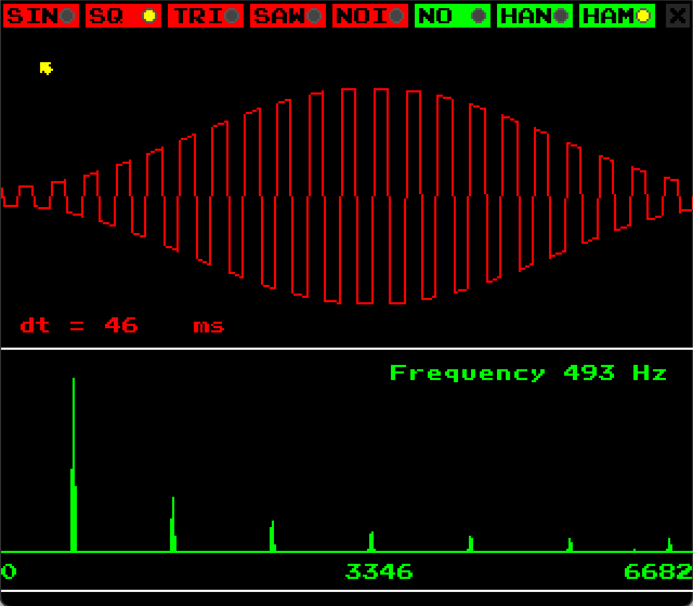

# Synth

`Synth` is a sound synthesizer, visualizer, and spectral analyzer. It was inspired by a One Lone Coder [YouTube video](https://www.youtube.com/watch?v=tgamhuQnOkM)) ([GitHub](https://github.com/OneLoneCoder/synth)).

`Synth` is written using [`GL GFX`](../README.md) and relies on the [FFTW](http://fftw.org) library for spectral analysis.



## Usage

`Synth` is compiled with:

```shell
cmake .
make
```

This results in a binary executable called `Synth`, which is invoked as:

```shell
./Synth
```

`Synth` relies on the keyboard for input. The table below lists the keys that are recognized and their associated action.

|key|action|
----|-----
|`1`|noise generator|
|`2`|square wave generator|
|`3`|triangular wave generator|
|`4`|sawtooth wave generator|
|`5`|sine wave generator|
|`8`|hanning window|
|`9`|hamming window|
|`0`|no window|
|`z` `s` `x` `c` `f` `v` `g` `b` `n` `j` `m` `k` `,` `l` `.` `/`|piano keys 49-64|
|`p`|show FPS|
|`q`|quit|

## Notes

1. On first run `Synth` can take longer to start up as it will generate an optimized `FFT`-plan and store it in the running directory as `plan.fftw` for future use.

## BSD-3 License

Redistribution and use in source and binary forms, with or without modification, are permitted provided that the following conditions are met:

1. Redistributions of source code must retain the above copyright notice, this list of conditions and the following disclaimer.

2. Redistributions in binary form must reproduce the above copyright notice, this list of conditions and the following disclaimer in the documentation and/or other materials provided with the distribution.

3. Neither the name of the copyright holder nor the names of its contributors may be used to endorse or promote products derived from this software without specific prior written permission.

THIS SOFTWARE IS PROVIDED BY THE COPYRIGHT HOLDERS AND CONTRIBUTORS "AS IS" AND ANY EXPRESS OR IMPLIED WARRANTIES, INCLUDING, BUT NOT LIMITED TO, THE IMPLIED WARRANTIES OF MERCHANTABILITY AND FITNESS FOR A PARTICULAR PURPOSE ARE DISCLAIMED. IN NO EVENT SHALL THE COPYRIGHT HOLDER OR CONTRIBUTORS BE LIABLE FOR ANY DIRECT, INDIRECT, INCIDENTAL, SPECIAL, EXEMPLARY, OR CONSEQUENTIAL DAMAGES (INCLUDING, BUT NOT LIMITED TO, PROCUREMENT OF SUBSTITUTE GOODS OR SERVICES; LOSS OF USE, DATA, OR PROFITS; OR BUSINESS INTERRUPTION) HOWEVER CAUSED AND ON ANY THEORY OF LIABILITY, WHETHER IN CONTRACT, STRICT LIABILITY, OR TORT (INCLUDING NEGLIGENCE OR OTHERWISE) ARISING IN ANY WAY OUT OF THE USE OF THIS SOFTWARE, EVEN IF ADVISED OF THE POSSIBILITY OF SUCH DAMAGE.
